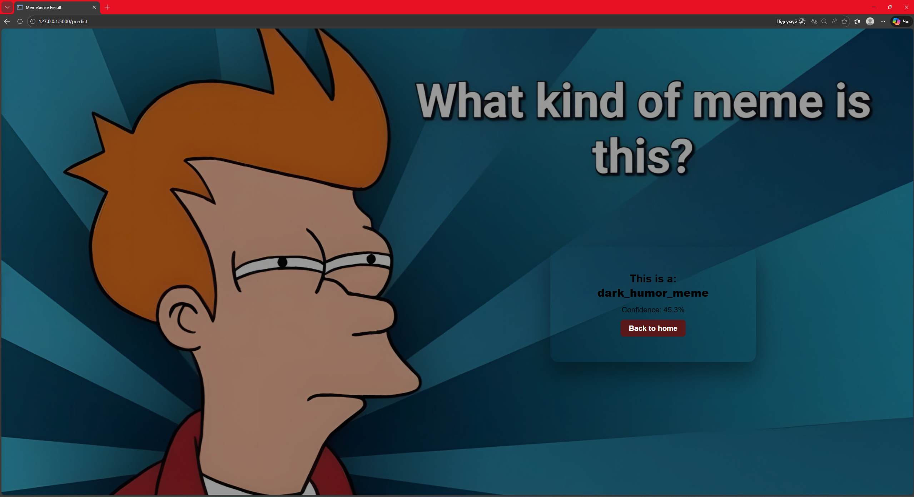
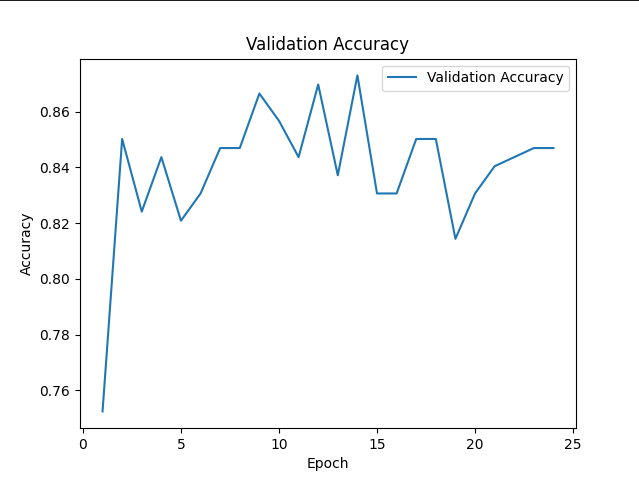

**MemeSense**

MemeSense is a multimodal AI system that automatically classifies memes into categories using 
both **image content** and **text extracted from the meme**.

The model combines computer vision and natural language processing
to understand memes more accurately.

The project is designed to run in a Linux-based environment (WSL) and supports both web 
and command-line usage.


## Features

- Upload a meme image through a web interface
- Automatic text extraction using OCR
- Multimodal neural network combining image and text features
- Meme classification into categories
- Confidence score for predictions
- Web interface built with Flask
- Command-line interface for direct inference


## Model Architecture

The system uses a multimodal deep learning model:

- Image encoder: CNN (ResNet-based feature extractor)
- Text encoder: DistilBERT
- Fusion layer: combines image and text embeddings
- Classifier: predicts meme category

Pipeline:

1. User uploads a meme
2. OCR extracts text from the image
3. Image → CNN encoder
4. Text → DistilBERT encoder
5. Features are fused in a multimodal model
6. The model predicts the meme category


## Meme Categories

The model classifies memes into the following categories:

- "animal_meme"
- "dark_humor_meme"
- "reaction_meme"
- "screenshot_meme"
- "text_meme"


## Web Interface

The web interface allows users to:

- Upload a meme image
- Run AI classification
- See prediction results and confidence score

Built with:

- Python
- Flask
- HTML + CSS


##  Technologies Used

- Python
- PyTorch
- Transformers (HuggingFace)
- DistilBERT
- OpenCV / PIL
- Tesseract OCR
- Flask
- Linux (WSL)
- HTML / CSS


## Installation

⚠️ Important: Large Files (Git LFS)
This project uses Git LFS to store model weights (.pt and .pth files).
Before cloning, ensure you have Git LFS installed:

Download and install Git LFS.

Run git lfs install in your terminal.


### 1. Clone repository

```bash
git clone https://github.com/yourusername/MemeSense.git
cd MemeSense

# Download large files (Git LFS)
git lfs pull
```

## 2. Create virtual environment

Windows:
python -m venv venv
venv\Scripts\activate

Linux / WSL / Mac:
python3 -m venv .venv
source .venv/bin/activate

## 3. Install dependencies

pip install -r requirements.txt

## 4. Install Tesseract OCR

Install Tesseract and set path in code:

pytesseract.pytesseract.tesseract_cmd = "PATH_TO_TESSERACT"

## 5. Run application

python app.py

Open in browser:

http://127.0.0.1:5000


## Run inference from CLI

```bash
python -m ml.predict "path/to/image.jpg"

# Example:
python -m ml.predict "data/test/dark_humor_meme/dark_humor (259).jpg"

# Output:
# Class: dark_humor_meme
# Confidence: 0.70
```


## Interface

**Main Page**

.png)

**Result Page**


**Training vs Validation loss**


**Validation accuracy**



## 📁 Project Structure
```text
MemeSense/
├── data/                  # Raw and processed datasets (ignored by Git)
│   ├── test/              # 5 meme categories for testing
│   ├── train/             # Training set
│   └── val/               # Validation set
├── ml/                    # Machine Learning Core
│   ├── fusion/            # Multimodal fusion model logic
│   ├── image/             # Computer Vision (CNN) components
│   ├── text/              # NLP (DistilBERT) components
│   ├── preprocessing/     # OCR & image cleaning
│   └── predict.py         # Inference script for Flask
├── training_result/       # AI Training outputs (Models & Analytics)
│   ├── *.pt, *.pth        # Trained model weights (LFS)
│   ├── training_loss.png  # Loss curves
│   └── training_accuracy.png # Accuracy plots
├── screenshots/           # UI screenshots for README
├── static/                # Web assets (CSS, background images)
├── templates/             # Flask HTML templates
├── app.py                 # Main Web application
├── requirements.txt       # Project dependencies
└── .gitattributes         # Git LFS settings for model files
